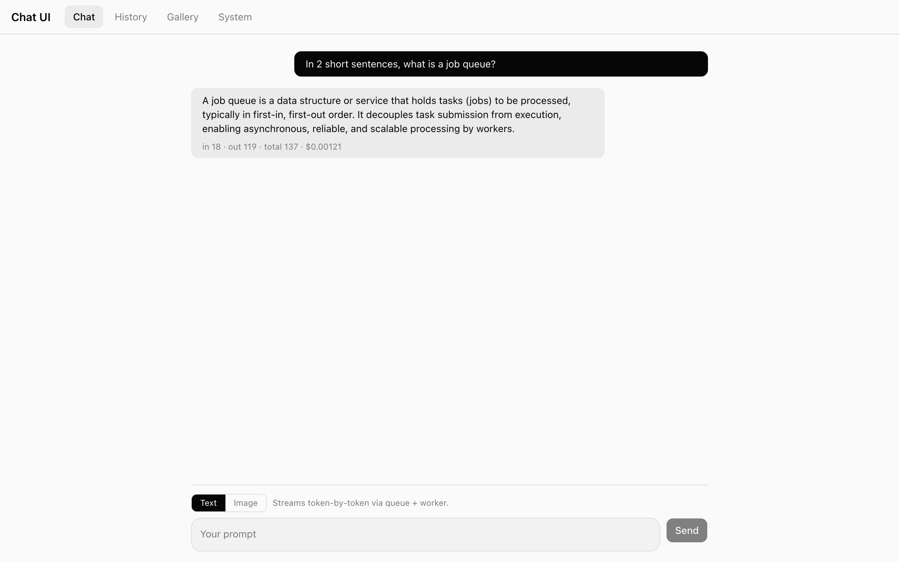

# Chat UI

Full-stack AI chat agent with a queued worker pipeline, token-by-token streaming, image generation, persistent history, and a live observability dashboard. Forked from the [Vercel Chatbot template](https://github.com/vercel/chatbot) and extended with the queue + worker + dashboard architecture described in [`docs/action-plan.md`](./docs/action-plan.md).




## Quick start (Docker)

Requires Docker Desktop and an OpenAI API key.

```bash
# 1. Copy the env template and fill in secrets
cp .env.example .env.local
#    Set at least:
#      AUTH_SECRET=$(openssl rand -base64 32)
#      OPENAI_API_KEY=sk-...

# 2. Bring up the whole stack (postgres, redis, migrate, app, worker)
docker compose up -d

# 3. Open the app
open http://localhost:3000
```

First `docker compose up` builds the `chat-ui-app:local` image and runs migrations via a one-shot `migrate` service. Subsequent runs reuse the image and skip migrations if already applied.

### Useful Docker commands

```bash
docker compose ps                        # service status
docker compose logs -f app worker        # tail logs
docker compose restart worker            # restart just the worker
docker compose down                      # stop, keep data
docker compose down -v                   # stop + wipe postgres + redis volumes
docker compose build migrate             # rebuild the shared image after code changes
docker compose up -d --force-recreate app worker
```

## What it does

Every prompt — Text or Image — becomes a durable **Job** row in Postgres, is enqueued into **BullMQ**, and is executed by a separate **worker** process that calls OpenAI via the AI SDK. Text tokens stream back over **Redis Pub/Sub** to an SSE endpoint, with reconnect-safe replay from a persisted Redis list; images are returned as base64 data URLs. Every completed job carries real token counts and USD cost, written atomically, and a System tab surfaces queue depth, worker heartbeat, active streams, and a live log tail.

```
┌────────┐  POST /api/jobs                    ┌──────────┐        ┌──────────┐
│ Client │ ─────────────────────────────────▶ │ Next.js  │ ─────▶ │  Redis   │
│        │                                    │  app     │        │ (BullMQ +│
│        │  GET /api/jobs/:id/stream  (SSE)   │          │        │  Pub/Sub)│
│        │ ◀──────── delta / done ──────────  │          │        └────┬─────┘
└────────┘                                    └────┬─────┘             │
                                                   │                   ▼
                                              Postgres            ┌──────────┐
                                              (Job, Result) ◀──── │  Worker  │ ──▶ OpenAI
                                                                  └──────────┘     (gpt-5 /
                                                                                    gpt-image-1)
```

## Tech stack

| Layer              | Choice                                                                |
| ------------------ | --------------------------------------------------------------------- |
| Framework          | Next.js 16 (App Router, Cache Components) + TypeScript                |
| UI                 | Tailwind 4 + shadcn/ui + Radix + sonner + SWR                         |
| ORM / DB           | Drizzle + PostgreSQL 16                                               |
| Queue / Pub/Sub    | BullMQ + Redis 7 (one Redis for queue, pub/sub, heartbeat, log tail)  |
| AI                 | AI SDK v6 + `@ai-sdk/openai` (`gpt-5` text, `gpt-image-1` images)     |
| Auth               | Auth.js (next-auth 5 beta) — guest mode only                          |
| Tests              | Playwright                                                            |
| Orchestration      | Single Dockerfile + `docker-compose.yml` (postgres, redis, migrate, app, worker) |

## Tabs

| Tab     | Route       | What it does                                                     |
| ------- | ----------- | ---------------------------------------------------------------- |
| Chat    | `/`         | Text \| Image composer. Text streams via SSE; Image polls.       |
| History | `/history`  | Reverse-chrono job list with filters; failed jobs in red.        |
| Gallery | `/gallery`  | Grid of completed image jobs with prompt + cost.                 |
| System  | `/system`   | Queue depth, worker heartbeat, active streams, live log tail.    |


## Local development (without Docker)

Requires Node 20+, pnpm 10.32.1 (`corepack prepare pnpm@10.32.1 --activate`), and a reachable Postgres + Redis.

```bash
pnpm install

# Boot just the stateful services
docker compose up -d postgres redis
pnpm db:migrate

# Two terminals
pnpm dev                                 # Next.js on :3000
pnpm exec tsx worker/index.ts            # worker
```

`.env.local` is auto-loaded by both Next.js and the worker (`worker/index.ts` calls dotenv at the top, because `tsx` doesn't read env files on its own).

## Environment variables

Copy `.env.example` → `.env.local`. Required ones are marked **yes**.

| Variable                        | Required | Used by         | Default / notes                         |
| ------------------------------- | -------- | --------------- | --------------------------------------- |
| `AUTH_SECRET`                   | **yes**  | Next (NextAuth) | 32-byte random                          |
| `OPENAI_API_KEY`                | **yes**  | worker          | gpt-5 + gpt-image-1                     |
| `POSTGRES_URL`                  | **yes**  | all DB callers  | compose overrides to internal hostname  |
| `REDIS_URL`                     | **yes**  | app + worker    | compose overrides to internal hostname  |
| `AI_GATEWAY_API_KEY`            | no       | template        | unused on hot path                      |
| `BLOB_READ_WRITE_TOKEN`         | no       | template        | unused                                  |
| `GPT5_INPUT_PRICE_PER_1M`       | no       | pricing         | 1.25                                    |
| `GPT5_OUTPUT_PRICE_PER_1M`      | no       | pricing         | 10                                      |
| `GPT_IMAGE_1_PRICE_PER_IMAGE`   | no       | pricing         | 0.04                                    |
| `OPENAI_TEXT_MODEL`             | no       | worker          | `gpt-5`                                 |
| `OPENAI_IMAGE_MODEL`            | no       | worker          | `gpt-image-1`                           |
| `OPENAI_IMAGE_SIZE`             | no       | worker          | `1024x1024`                             |
| `WORKER_CONCURRENCY`            | no       | worker          | 4                                       |

## Testing

Playwright E2E specs live under [`tests/e2e/`](./tests/e2e/). They drive the whole stack and require a running app + worker + DB + Redis + a working `OPENAI_API_KEY`.

```bash
docker compose up -d                     # full stack
pnpm test                                # all specs
pnpm exec playwright test tests/e2e/chat.test.ts --headed
pnpm exec playwright show-report         # open the last HTML report
```

Specs:

- `chat.test.ts` — submit a text prompt, assert streaming deltas + final tokens + cost render.
- `image.test.ts` — submit an image prompt, wait for the generated image to appear, then verify it shows in the Gallery.
- `history.test.ts` — enqueue via API, assert the row appears and reaches a terminal state.
- `dashboard.test.ts` — enqueue N jobs, assert the System tab's Completed counter strictly increases.

## HTTP API

| Method | Route                          | Purpose                                      |
| ------ | ------------------------------ | -------------------------------------------- |
| POST   | `/api/jobs`                    | Create + enqueue a job (zod-validated).      |
| GET    | `/api/jobs`                    | Paginated list; filter by `type` / `status`. |
| GET    | `/api/jobs/:id`                | Job row + result output.                     |
| GET    | `/api/jobs/:id/stream`         | SSE: replay + live deltas for TEXT jobs.     |
| GET    | `/api/system/stats`            | Dashboard feed.                              |

Full request/response shapes in [`docs/api.md`](./docs/api.md).

## Project layout

```
chat-ui/
├── app/
│   ├── layout.tsx                ← root layout with TabsNav + providers
│   ├── page.tsx                  ← Chat tab
│   ├── history/, gallery/, system/page.tsx
│   └── api/jobs, api/system/stats, (auth)/, (chat)/
├── components/
│   ├── tabs-nav.tsx
│   ├── chat-tab/, history-tab/, gallery-tab/, system-tab/
│   └── ui/                       ← shadcn primitives
├── lib/
│   ├── db/schema.ts              ← Job + Result + template tables
│   ├── db/jobs.ts                ← helpers shared by Next AND worker
│   ├── queue.ts                  ← BullMQ queue, Redis keys, channel helpers
│   ├── pricing.ts                ← env-driven per-token + per-image prices
│   └── system/metrics.ts         ← in-memory active-stream counter
├── worker/
│   ├── index.ts                  ← BullMQ Worker, concurrency 4, retry 3
│   ├── heartbeat.ts, log.ts
│   └── processors/{text,image}.ts
├── tests/e2e/                    ← Playwright specs
├── docs/                         ← detailed per-component specs
├── scripts/screenshot.ts         ← README screenshot capture
├── Dockerfile                    ← one image, three services
├── docker-compose.yml
└── .env.example
```

## Documentation

Per-component specs live under [`docs/`](./docs/). Each ends with a "Realises" section tying it back to the PRD and action plan.

- [`CLAUDE.md`](./CLAUDE.md) — entrypoint, directory map, commands, conventions.
- [`docs/architecture.md`](./docs/architecture.md) — system overview, request flows, design decisions.
- [`docs/postgres.md`](./docs/postgres.md) — schema, migrations, Drizzle gotchas.
- [`docs/redis.md`](./docs/redis.md) — queue + pub/sub + heartbeat + log tail.
- [`docs/worker.md`](./docs/worker.md) — processors, retries, observability.
- [`docs/api.md`](./docs/api.md) — route-by-route reference.
- [`docs/ui.md`](./docs/ui.md) — tab structure and components.
- [`docs/auth.md`](./docs/auth.md) — guest flow and the secureCookie HTTP fix.
- [`docs/docker.md`](./docs/docker.md) — image and compose topology.
- [`docs/testing.md`](./docs/testing.md) — Playwright setup.
- [`docs/action-plan.md`](./docs/action-plan.md) — original phased build plan.
- [`prd-draft.md`](./prd-draft.md) — product requirements.
